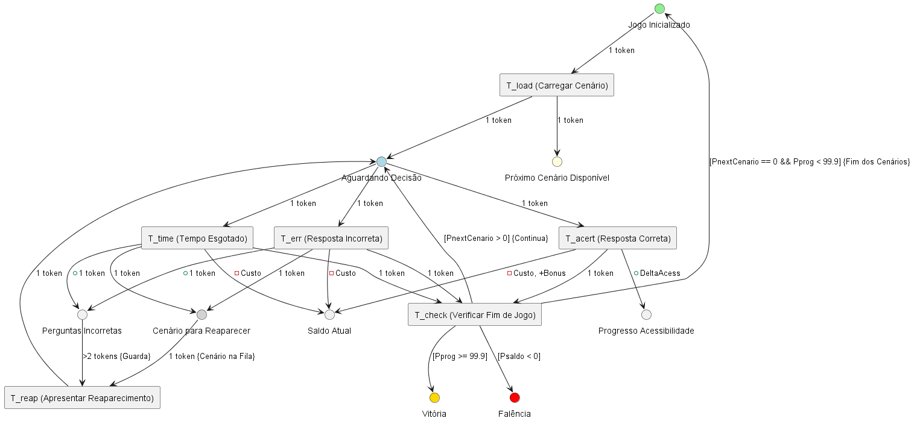
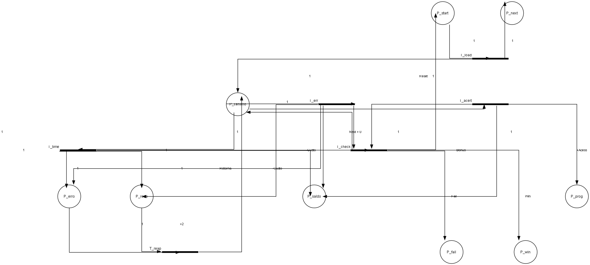
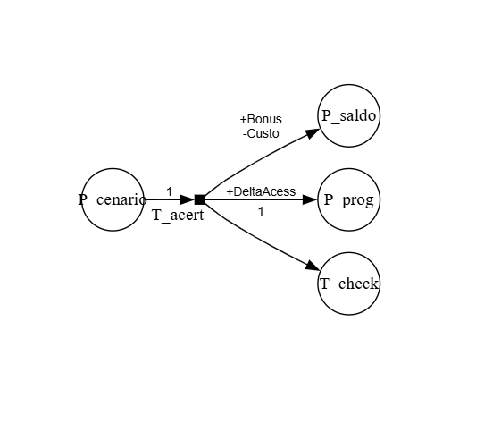
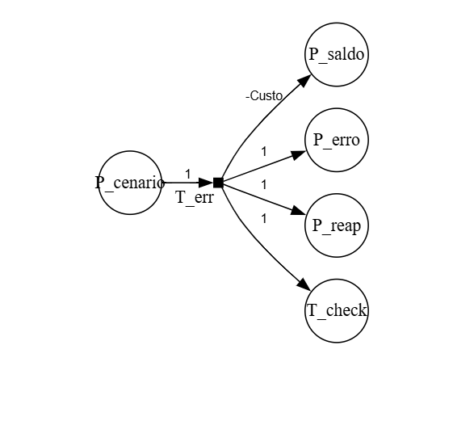
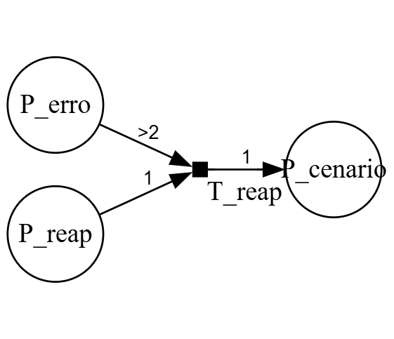
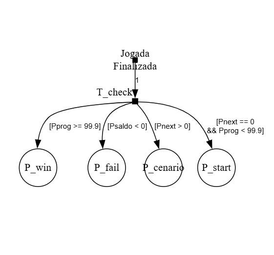

# ProjetoSustentabilidade
Projeto da Disciplina de Métodos Formais que atende a ODS 11.7
-----------------------------------------------------------
Documentação de Software na Versão:1.2
-----------------------------------------------------------
# Definição do Projeto: Jogo Interativo de Acessibilidade
-----------------------------------------------------------
O projeto consiste no desenvolvimento de um jogo interativo que visa a conscientização sobre a importância da acessibilidade e do design inclusivo em ambientes públicos e privados. Utilizando a mecânica de um quiz dinâmico, similar ao Kahoot, o jogo será uma ferramenta educativa e engajadora. Seu principal objetivo é transcender a teoria, colocando o jogador em uma posição ativa de solução de problemas. Ao simular situações do cotidiano, ele desafia o público a identificar as necessidades de diferentes grupos de pessoas – como obesos, idosos, cadeirantes, gestantes e pessoas com deficiência sensorial ou mental – e a selecionar os objetos e recursos de acessibilidade adequados para garantir sua plena participação na sociedade.

A estrutura do jogo é baseada em três etapas bem definidas que promovem a aprendizagem pela prática. Na primeira etapa, o jogador é confrontado com a imagem de uma pessoa com uma necessidade específica (por exemplo, um cadeirante ou uma pessoa com deficiência visual). Em seguida, o jogo apresenta um cenário real e um desafio de acessibilidade, como a falta de uma rampa em um banco ou a ausência de um piso tátil em uma calçada. Por fim, o jogador deve escolher rapidamente as soluções corretas a partir de uma lista de opções (como Barra de apoio, Piso Tátil Direcional ou Assento Acessível). O sistema de pontuação e o feedback imediato – que faz o jogador tentar novamente em caso de erro – reforçam o aprendizado e a memorização das soluções.

Alinhado com a ODS (Objetivo de Desenvolvimento Sustentável) de Inclusão e Redução de Desigualdades, a ODS 11: Cidades e Comunidades Sustentáveis especificando o ponto  11.7 que busca "proporcionar o acesso universal a espaços públicos seguros, inclusivos, acessíveis e verdes, particularmente para as mulheres e crianças, pessoas idosas e pessoas com deficiência." este projeto tem como meta combater a invisibilidade das barreiras físicas e atitudinais. De forma indireta direciona par o conhecimento sobre normas de acessibilidade (como NBR 9050) em uma experiência divertida, o jogo atinge um público amplo – de estudantes a profissionais e tomadores de decisão – de forma eficiente. Mais do que apenas pontuar, a experiência busca gerar empatia ao fazer o jogador "calçar o sapato" do outro, compreendendo as frustrações diárias causadas pela falta de preparo dos espaços.
Em resumo, o projeto é uma solução de edutainment (educação + entretenimento) que utiliza a gamificação para promover a cidadania e o respeito. O foco não está apenas em listar objetos, ou gerar provocações, mas em criar a conexão prática entre a limitação da pessoa (física, mental ou comorbidade) e a intervenção necessária para que ela exerça sua autonomia. Ao fornecer aos jogadores o poder de "corrigir" o ambiente, o jogo busca formar indivíduos mais conscientes e capazes de exigir e implementar espaços verdadeiramente acessíveis, contribuindo ativamente para a construção de uma sociedade mais justa e igualitária.

--------------------------
##  Objetivo do Projeto
--------------------------
Este projeto é um jogo de simulação e gestão focado em conscientizar sobre a importância da acessibilidade em ambientes urbanos, alinhado ao **Objetivo de Desenvolvimento Sustentável (ODS) 11.7: Proporcionar acesso universal a espaços públicos seguros, inclusivos e acessíveis, em particular para mulheres, crianças, idosos e pessoas com deficiência.**

O jogador atua como um gestor que deve tomar decisões rápidas sobre quais recursos de acessibilidade instalar, equilibrando o **Orçamento (Saldo)**, a **Satisfação** dos usuários e o **Índice de Acessibilidade** geral.

---------------------------
## Como Executar o Jogo
---------------------------
O projeto é baseado em HTML, CSS e JavaScript Vanilla e pode ser executado localmente.

### Pré-requisitos

1.  Um editor de código **Visual Studio Code**.
2.  A extensão **Live Server** instalada no VS Code.

### Passos para Rodar

1.  Clone o repositório ou baixe o código-fonte.
2.  Abra a pasta do projeto no VS Code.
3.  Clique com o botão direito no arquivo `index.html` e selecione **"Open with Live Server"**.
4.  O jogo será aberto automaticamente no seu navegador configurado (Recomendado: Chrome).

## Mecânicas e Regras do Jogo

O jogo é composto por 11 cenários, nos quais diferentes perfis de usuários (gestantes, idosos, cadeirantes, etc.) apresentam uma necessidade de acessibilidade.

### Requisitos Funcionais (RFs) Implementados

| RF | Funcionalidade | Descrição |
| :--: | :--- | :--- |
| **RF01** | Cenários | Exibe o perfil do usuário, o ícone correspondente e a pergunta. |
| **RF02** | Cronômetro | Contagem regressiva de 15 segundos para resposta. Classifica o tempo como "RÁPIDO" (≤ 7s) ou "LENTO" (> 7s). |
| **RF03** | Selecionar Resposta | O sistema deve exibir as opções de resposta disponíveis (objetos de acessibilidade) e permitir que o jogador selecione uma delas. |
| **RF04** | Gestão de Saldo | O Saldo inicial é de R$ 1.000,00. **Correta/Incorreta:** Débito do Custo do Objeto Correto. **Bônus RÁPIDO:** Saldo recebe bônus por acerto rápido. **Fim de Jogo:** O Saldo negativo encerra o jogo por Falência. |
| **RF05** | Satisfação | **Correta:** Aumenta pela Pontuação do Objeto Correto. **Incorreta/Esgotado:** Diminui pela Pontuação do Objeto Correto. |
| **RF06** | Acessibilidade | Aumenta em `(100 / Total de Cenários)` por acerto correto. **Vitória:** 100% encerra o jogo. |
| **RF07** | Reaparecimento | A cada 2 perguntas respondidas, se houver respostas incorretas, a primeira incorreta é repetida para fixação. |
| **RF09** | Pausa do Jogo | Implementação de uma tela de pausa que congela o cronômetro e o estado do jogo. O retorno é feito clicando na tela de sobreposição. |
| **RF10** | Recomeço da Partida | O sistema deve prover um botão na tela de Fim de Jogo  que, quando acionado, reinicia o jogo para o estado inicial, permitindo ao usuário jogar novamente. |

## Estrutura do Projeto

| Arquivo/Pasta | Descrição |
| :--- | :--- |
| `index.html` | Estrutura principal do jogo (UI - Interface do Usuário). |
| `style.css` | Estilização da interface e dos estados de resposta/pausa. |
| **`src/app.js`** | **Lógica principal:** Gerencia o estado (`gameState`), o fluxo de cenários, a inicialização e coordena a RF09 (Pausa). |
| **`src/timer.js`** | Lógica do cronômetro, contagem regressiva e classificação de tempo. |
| **`src/calc.js`** | **Lógica de Score:** Implementa as regras complexas de RF04 e RF05 (Débito, Bônus RÁPIDO, Penalidade e Verificação de Falência). |
| `data/gameData.json` | Contém os 11 cenários, as opções de resposta e os IDs corretos. |
| `assets/` | Pasta para todos os recursos (imagens, ícones de perfil, etc.). |


--------------------------
# Diagrama de Casos de Uso
--------------------------
```mermaid
graph TD
    %% Define os Atores
    actor_j[Jogador]
    actor_s[Sistema]

    %% Define o Contêiner e os Casos de Uso
    subgraph Sistema: Acessibilidade para Todos
        uc1(UC1: Iniciar Partida)
        uc2(UC2: Visualizar HUD)
        uc3(UC3: Responder Cenário)
        uc4(UC4: Gerenciar Estado)
        uc5(UC5: Pausar/Continuar)
        uc6(UC6: Encerrar Partida)
        uc7(UC7: Reiniciar Partida)
    end

    %% Relações do Jogador e Fluxo Principal (Associações e Includes)
    actor_j --> uc1
    actor_j --> uc3
    actor_j --> uc5
    actor_j --> uc7

    uc1 --> uc2
    uc3 --> uc4
    uc4 --> uc2

    %% Relações Conditionais (Extend) - Sintaxe Limpa
    uc4 --> uc6
    uc4 -.- uc6
    uc4 -.-> uc6(Encerrar Partida)

    uc4 -.-> uc6
    linkStyle 10 stroke-dasharray: 5 5
    
    uc4 -.-> uc6
    linkStyle 10 stroke-dasharray: 5 5

    %% Relações Conditionais (Extend) - Sintaxe Limpa
    uc4 -.-> uc6
    uc5 -.-> uc4
    
    %% Reinício e Atores Secundários
    uc6 --> uc7
    uc7 --> uc1
    actor_s --> uc4
 ```
 --------------------------
 # Diagrama de Classe
 --------------------------
 ```mermaid
classDiagram
    direction LR

    %% ----------------------------------
    %% CLASSES DE DADOS (Estruturas de Objeto)
    %% ----------------------------------
    class GameState {
        + float saldo
        + int satisfacao
        + float acessibilidade
        + list perguntasIncorretas
        + int nextCenarioIndex
        + int reappearanceCounter
        + boolean isPaused
    }
    
    class ObjetoAcessibilidade {
        + int id
        + string nome
        + int pontuacao
        + float custo
    }
    
    class Cenario {
        + int id
        + string pergunta
        + string icone
        + list opcoes
        + int respostaCorretaID
    }
    
    %% Relação: Catálogo de Objetos é usado pelos Cenários (Opções)
    ObjetoAcessibilidade "1" -- "N" Cenario : Opções Usam >

    %% ----------------------------------
    %% CLASSES DE CONTROLE (Módulos JS)
    %% ----------------------------------
    class GameController {
        + updateHUD()
        + loadScenario()
        + handleAnswer()
        + processAnswer()
        + togglePause()
        + endGame()
    }
    
    class ScoreCalculator {
        + calculateScore(ID, Class, isCorrect)
    }

    class TimerController {
        + startTimer(callback)
        + stopTimer()
        + pauseTimer()
        + continueTimer()
    }

    %% ----------------------------------
    %% RELAÇÕES DE DEPENDÊNCIA
    %% ----------------------------------

    %% O GameController gerencia o estado e depende dos dados
    GameController "1" --> "1" GameState : Gerencia o status do jogo >
    GameController "1" --> "N" Cenario : Usa/Carrega >
    GameController ..> ObjetoAcessibilidade : <<getObjetoDetalhes>>

    %% O Controlador de Jogo (app.js) aciona as outras classes/módulos
    GameController --> ScoreCalculator : Usa para cálculo >
    GameController --> TimerController : Controla o cronômetro >

    %% O ScoreCalculator precisa dos dados do Objeto e do Estado
    ScoreCalculator ..> ObjetoAcessibilidade : Usa catálogo >
    ScoreCalculator "1" --> "1" GameState : Altera o status do jogo >
```

## Especificação Formal do Projeto: Análise Estrutural e Comportamental

Este projeto utiliza duas abordagens de modelagem distintas para documentar a **estrutura estática** e o **comportamento dinâmico** do sistema, garantindo a qualidade e a capacidade de análise do software.


###  Rede de Petri em Métodos Formais

| Componente | Arquivo de Origem |
| :---: | :---: |
| Comportamento Dinâmico | `rede_de_petre.puml` |
| Comportamento Dinâmico | `diagrama.puml` |

Este arquivo contém o **código DOT (Graphviz)** que define o **Diagrama de Rede de Petri**, uma técnica de **métodos formais** utilizada para modelar e analisar sistemas dinâmicos, como o fluxo de estados e recursos do seu jogo. Os **componentes** primários são os **Lugares** ($P$, círculos) que representam **estados** ou **recursos** (ex: $P_{saldo}$, $P_{cenario}$) e as **Transições** ($T$, retângulos finos) que representam **eventos** ou **ações** (ex: $T_{acert}$, $T_{check}$). O estado atual do sistema é dado pela **Marcação**, que é a distribuição de **Fichas** (*tokens*) nos Lugares.

O **comportamento** modelado é a **dinâmica** do sistema, ou seja, *quando* e *como* as mudanças de estado ocorrem. Uma Transição só pode ser **disparada** se todos os seus Lugares de entrada contiverem o número suficiente de Fichas, respeitando as **Guardas** nos arcos. O disparo consome Fichas dos Lugares de entrada e produz Fichas nos Lugares de saída, modelando o fluxo de controle e a transformação de recursos. Este modelo permite provar propriedades críticas do jogo, como vivacidade e ausência de *deadlocks*.



### Representação no formato Tradicional 




 
 # Diagramas Didáticos de Cenários (Códigos DOT)
 
 Para simplificar e focar na didática, apliquei o estilo tradicional (círculo/barra) usaremos o layout padrão (dot) para clareza e separação rápida.Facilitando a comprenção por cenários do Jogo aplicados em rede de petri tradicionais.
 

 ### 1. Cenário: Ação Bem-Sucedida ($T_{acert}$)
 Este cenário de teste modela uma interação do jogador que resulta em sucesso. Quando a transição $T_{acert}$ dispara, o sistema consome uma unidade do recurso $P_{cenario}$ (encerrando a situação atual) e realiza o aumento do recurso $P_{prog}$ (progresso) e a atualização do $P_{saldo}$ com o bônus menos o custo da jogada. O comportamento essencial é o fluxo de uma única ficha para $T_{check}$, indicando que a jogada foi concluída e o sistema deve avançar para a próxima etapa de verificação de fim de jogo.

 
 
 ### 2. Cenário: Ação com Erro ou Tempo Esgotado ($T_{err}$ / $T_{time}$)
 Este cenário modela uma interação do jogador que resulta em falha, seja por uma resposta incorreta ($T_{err}$) ou por expiração de tempo ($T_{time}$). O disparo consome o $P_{cenario}$ e debita o custo no $P_saldo$. O comportamento central é a produção simultânea de fichas nos lugares $P_{erro}$ e $P_{reap}$ (reaparecimento), registrando a falha e preparando o sistema para o possível re-enfileiramento do cenário, conforme especificado no Requisito Funcional (RF) de reaparecimento.

 
 
  ### 3. Cenário: Lógica de Reaparecimento (RF07)
  Este cenário isola a lógica de repetição de cenário por excesso de falhas. A transição $T_{reap}$ só pode ser disparada se a marcação de $P_{erro}$ for maior que 2 (a guarda $[>2]$ é satisfeita) E houver uma ficha em $P_{reap}$ (indicando um cenário passível de repetição). O disparo de $T_{reap}$ consome as fichas de erro e reaparecimento e produz uma ficha de volta em $P_{cenario}$, garantindo que o cenário problemático seja reinserido no sistema para nova tentativa, conforme a regra de mitigação de falhas.

  
 
  ### 4. Cenário: Verificação de Fim de Jogo ($T_{check}$)
  Este cenário define as condições de término e avanço após qualquer jogada ($T_{acert}$, $T_{err}$ ou $T_{time}$). A transição $T_{check}$ (Verificar) é o ponto de convergência de todos os fluxos de jogada. A partir dela, o sistema ramifica-se em quatro fluxos mutuamente exclusivos (apenas um pode ocorrer por vez), controlados por guardas (ex: $P_{prog} \ge 99.9$ para $P_{win}$ ou $P_{saldo} < 0$ para $P_{fail}$). Este cenário assegura a progressão correta para o próximo cenário ($P_{cenario}$) ou o término formal do jogo ($P_{win}$, $P_{fail}$ ou $P_{start}$).

  

